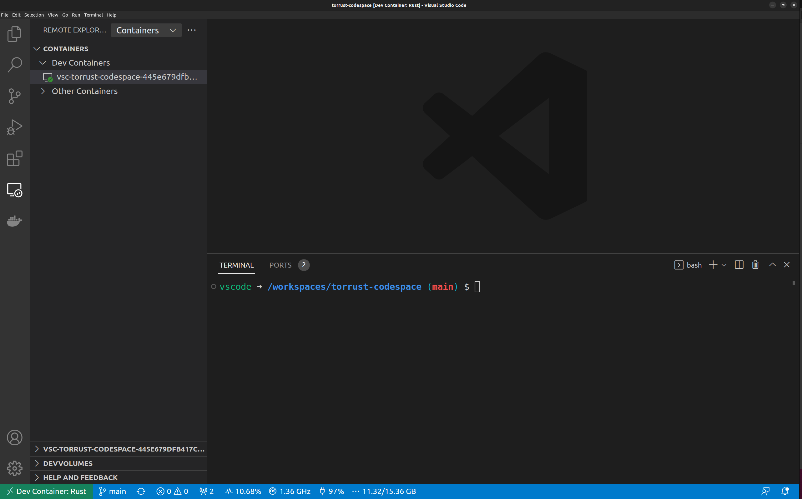

# How to install Torrust Tracker for development with GitHub Codespaces

- [Introduction](#introduction)
- [Requirements](#requirements)
- [How to start your your codespace](#how-to-start-your-your-codespace)
- [How to customize your dev container](#how-to-customize-your-dev-container)
- [Why you can't run it on GitHub Codespaces](#why-you-cant-run-it-on-github-codespaces)
- [Conclusion](#conclusion)
- [Links](#links)

## Introduction

I'm trying to find easy ways to setup a development environment to contribute to the [Torrust](https://github.com/torrust) projects. The [Torrust Organization](https://github.com/torrust) is developing a [BitTorrent](https://www.bittorrent.org/) [Tracker](https://wiki.theory.org/BitTorrent_Tracker_Protocol) and a torrent index, which is a site when you can search for torrents.

One option I wanted to tried was [GitHub Codespaces](https://github.com/features/codespaces). Codespaces are virtual machines running on Azure that you can use as you development environment. When you run a new codespace, what you really are doing is starting a new virtual machine on the [Microsoft Azure cloud](https://azure.microsoft.com/en-us/) and then running a docker image which is going to be your coding environment.

You can start new codespaces in different ways: from GitHub UI, from GitHub cli, Visual Studio Code.

In this tutorial I'm going to focus on how you can start a codespace for the Torrust Tracker and Index using [Visual Studio Code](https://code.visualstudio.com/).

## Requirements

For this tutorial I've used:

- Visual Studio Code 1.73.1.
- [GitHub Codespaces extension](https://marketplace.visualstudio.com/items?itemName=GitHub.codespaces)
- [Dev Containers extension](https://marketplace.visualstudio.com/items?itemName=ms-vscode-remote.remote-containers)

But you can read the [official documentation](https://docs.github.com/en/codespaces/developing-in-codespaces/using-github-codespaces-in-visual-studio-code) to know exactly the requirements you need. I only want to focus on how you can use codespaces for the Torrust software.

## How to start your your codespace

The first thing you have to do is to clone the repo as you would normally do and open the project with Visual Studio Code:

```s
cd /tmp
git@github.com:josecelano/torrust-codespace.git
cd torrust-codespace
code .
```


Since the repo contains this file `.devcontainer\devcontainer.json`, VS Code knows you can run a docker image to create a local codespace and It will show you a popup like this:


The `devcontainer.json` file contains the specification of what docker image you want to use. I'll explain that file in the next section. For now, you only need to know that it's there. If you do not have it, you can also run a codespace but using the default image.

You can click on the "Reopen in Container" button and VS Code will restart and it will start the docker container. That could take a while, because it has to pull the docker images and run your command defined in the `postCreateCommand` attribute of the `devcontainer.json`.

After one or two minutes (depending on your Internet connection and local machine) you can see you have a new dev container:



You can click the "RemoteExplorer" tab on the VS Code activity bar to see the new container and your codespaces. You can connect, stop, delete, rebuild containers, etcetera.

Codespaces are the ones you are running on GitHub infrastructure and containers are the ones you are running on your local machine. Since we are using the second option you should have a new running container like this:

```s
$ docker ps
CONTAINER ID   IMAGE                                                                 COMMAND                  CREATED       STATUS       PORTS     NAMES
87f9af1408ba   vsc-torrust-codespace-445e679dfb417cf2fd60bd8330cc4d81-features-uid   "/bin/sh -c 'echo Co…"   3 hours ago   Up 3 hours             elated_swartz
```

If you open a terminal inside the VS Code you are opening a shell inside the docker container.

That's all you need! Now you have to use the terminal and do all the stuff you would do to run the application and start developing new features.

Regarding ports, the cool thing is VS Code detects you are exposing some ports and It will forward them automatically so you can use your browser to load the app URLs.

In the next sections I will explain some things with more detail.

## How to customize your dev container

In this case, we are using a predefined image with some features. You can have your own docker image but GitHub also offers you a list of predefined images with a list of features you can add. So the system is very flexible and It will be enough in most cases.

Our devcontainer definition is like this:

```json
{
 "name": "Rust",
 "image": "mcr.microsoft.com/devcontainers/rust:1-bullseye",
 "features": {
  "ghcr.io/devcontainers/features/docker-in-docker:2": {},
  "ghcr.io/devcontainers/features/node:1": {}
 },
 "forwardPorts": [8080,3000],
 "postCreateCommand": "./setup.sh"
}
```

The Torrust index uses three services:

- A BitTorrent tracker in Rust.
- A torrent index that is a SPA. It uses VUE in the frontend and Rust in the backend.

I decided to use the Rust image which contains all the basic Rust stuff. And I added two features:

- `node`: we need it for the frontend.
- `docker-in-docker`: the index backend uses docker-compose to run a MySQL instanced needed by the database integration tests. Since the dev container is a docker container I supposed I would need this feature to run other container inside the dev container. The docker-compose works (I've tested it) but I have not tested if we really need this feature.

Regarding the ports. As I mentioned before, VS Code detects automatically (from the app output) that you are using some ports but you can also specify what ports you are using. I only wanted to expose the web app ports (frontend and rest API).

Finally, you can define a "postCreateCommand". That command will be called automatically after building the docker image and running it. I've only put there some stuff you need to manually type to set up the tracker and index. This is useful when you want developers to have a really ready-to-use environment, where they only have to run the services.

## Why you can't run it on GitHub Codespaces

Unfortunately I've been able to run this on the GitHub cloud codespaces. It would be nice if you can just click on the "Open in GitHub Codespaces" button.


It's not working because I'm using Git submodules to fetch all the services from their Git repos.

If you clone this repo on your local machine you will fetch all submodules because the setup is executing this Git command:

```s
git submodule update --init
```

But that command is not working on the cloud codespace. You can find more info [here](https://github.com/josecelano/torrust-codespace/issues/1). It should work because all the repositories are public.

Alternatively, you could create an independent codespace for each service. In fact, the official repositories should include the devcontainer configuration:

- <https://github.com/torrust/torrust-tracker>
- <https://github.com/torrust/torrust-index-backend>
- <https://github.com/torrust/torrust-index-frontend>

Sometimes you are working only on one of them and that would be enough. In that case you could create the codespace on the GitHub cloud.

On the other hand, if you want to keep them running for a long time, it would be more expensive. So I hope I can find a solution for this [issue](https://github.com/josecelano/torrust-codespace/issues/1).

## Conclusion

I think GitHub codespaces are useful because:

- It could help to standardize the development environment: VS Code plugins, linters, Rust version, ...
- It gives you a very easy way to deploy your app for testing purposes.

For me, one of the most interesting features is you can make the entrypoints public. You can run the codespace and access the app from a public URL. That would allow you to:

- Set up a testing environment for a pull request branch (feature branch), so that reviewers can use the app. That's very useful if your reviewers do not know how to setup the env locally.
- Or, set up an E2E testing environment. When a new pull request is created, you can run a new codespace, execute the app, and run a test suite, for example, by using Selenium. I have not research yet how to create codespaces automatically but I suppose there must be a way.

## Links

- [Developing in a codespace](https://docs.github.com/en/codespaces/developing-in-codespaces/developing-in-a-codespace)
